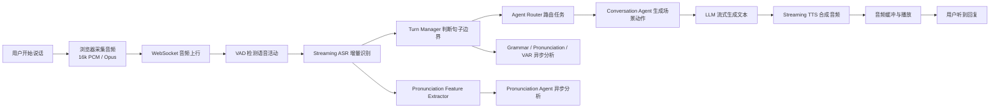
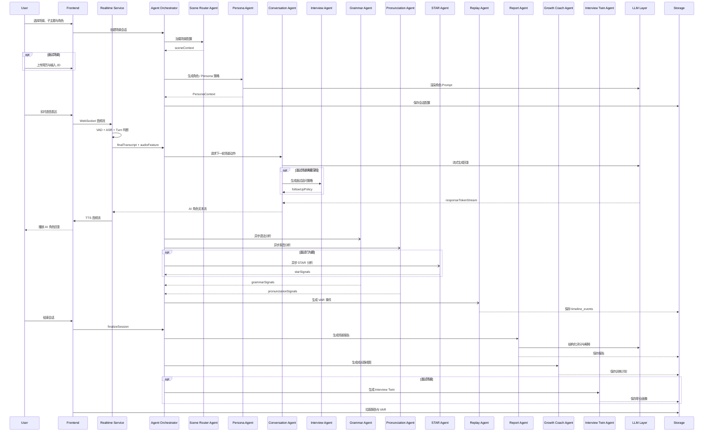
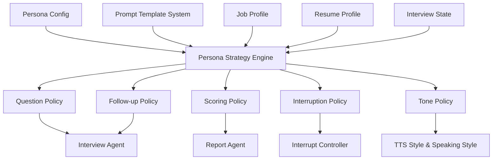
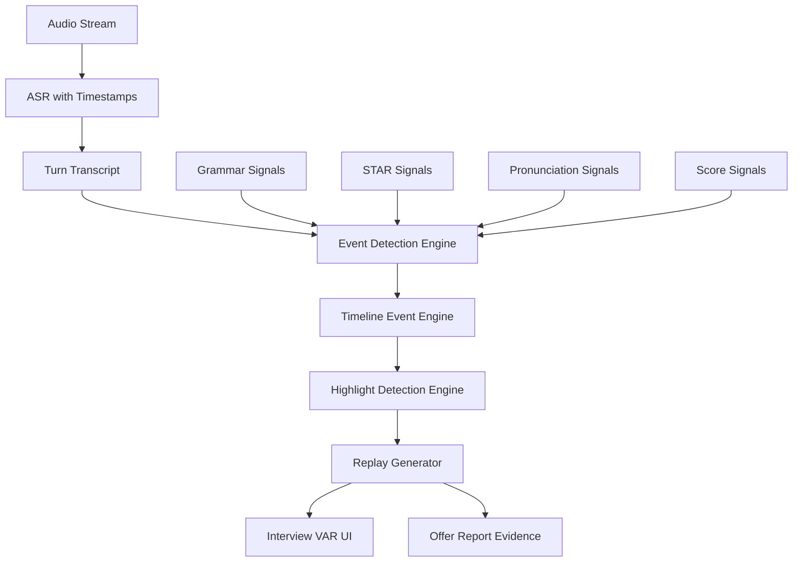
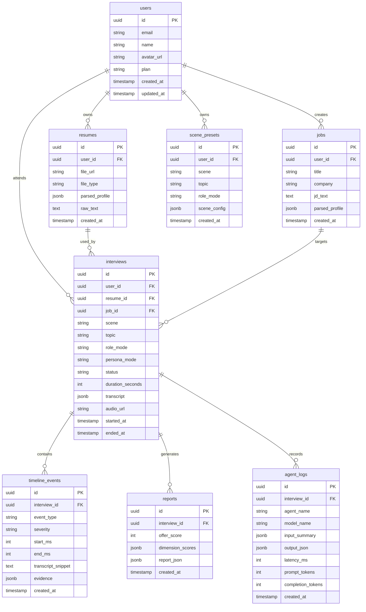
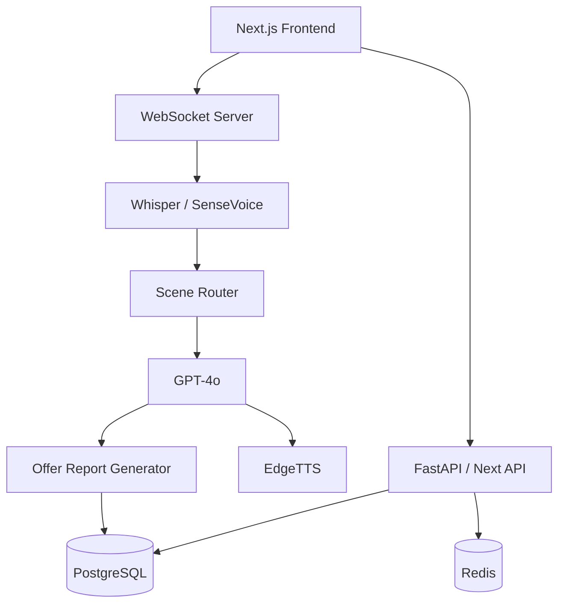
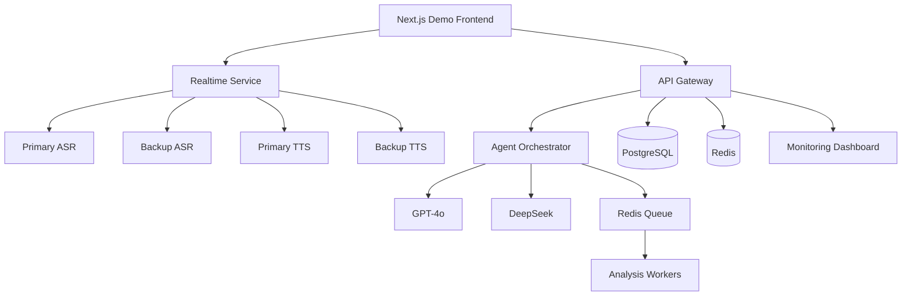
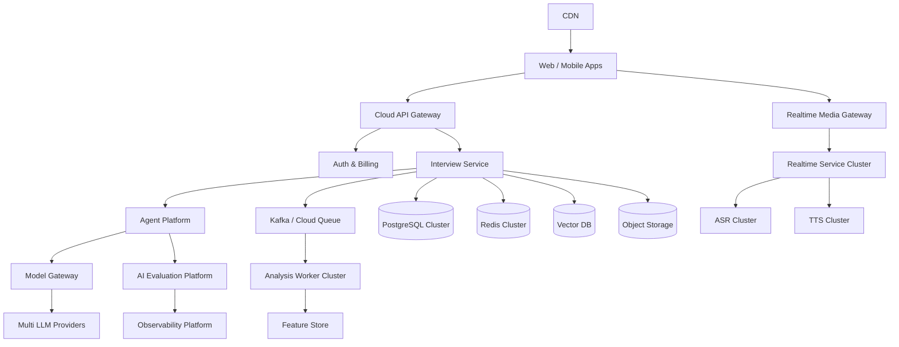

# SpeakUp AI 技术架构设计文档

文档版本：v2.0  
适用场景：72 小时黑客松开发、比赛 Demo 稳定运行、技术评审答辩  
产品名称：SpeakUp AI  
产品定位：AI Real-Scene English Speaking Coach，AI 真实场景英语口语陪练  
核心目标：通过面试、餐厅点餐和商务会议三类真实场景，结合实时英语语音对话、场景角色、轻量纠错、VAR 回放和场景报告，帮助用户提升可迁移的英语口语表达能力。

## 0. 架构设计摘要

SpeakUp AI 不是普通英语陪练产品，而是一个围绕”真实场景对话”构建的实时 AI Agent 系统。系统在 MVP 阶段支持求职面试、餐厅点餐和商务会议三类场景：面试场景保留简历、目标岗位 JD、面试官人格、连续追问、STAR 分析和 Offer Report；点餐与会议场景通过场景角色、子主题、功能句评分和专属报告覆盖日常与商务表达。用户获得的不只是聊天记录，而是一份可解释、可回放、可训练、可持续进化的口语成长画像。

从工程角度看，系统被拆分为七层：Frontend、Gateway、Realtime Service、Agent Layer、LLM Layer、Storage Layer、Monitoring Layer。Frontend 负责场景选择、子主题选择、简历上传、JD 输入、角色选择、实时语音采集、音频播放、VAR 时间轴展示和报告页面。Gateway 负责鉴权、限流、REST API、WebSocket 会话接入和路由。Realtime Service 负责 VAD、ASR、流式文本增量、TTS、音频缓冲、打断控制和端到端延迟控制。Agent Layer 是产品差异化核心，包含 Scene Router Agent、Conversation Agent、Persona Agent、Grammar Agent、Pronunciation Agent、STAR Agent、Replay Agent、Report Agent、Growth Coach Agent 和 Interview Twin Agent。LLM Layer 负责多模型路由、Prompt 模板渲染、函数调用、结构化输出、缓存和降级。Storage Layer 存储用户、简历、岗位、场景会话、时间轴事件、报告、Agent 日志和音频对象。Monitoring Layer 负责日志、指标、链路追踪、模型质量评估和 Demo 值守。

72 小时黑客松版本应优先完成一条高质量多场景主链路：用户先选择面试、点餐或会议场景，再进入对应配置化 Prompt、角色、评分规则和报告模板。面试场景完成简历/JD 解析、Persona 选择、实时英语面试、连续追问、英文纠错、STAR 评分、Offer Report 和 Interview VAR；点餐与会议场景至少完成子主题选择、角色对话、实时轻纠正、场景报告和 VAR 时间轴。P2 的 Interview Twin 和成长路线图可以先做轻量版本，以规则加 LLM 结构化总结实现，确保评委能看到未来扩展空间。

## 第一部分：系统总体架构

### 1.1 总体架构目标

系统总体架构围绕四个目标设计。

第一，低延迟。实时语音对话需要用户说完后尽快听到 AI 角色回应，系统必须支持 VAD 端点检测、ASR 流式识别、LLM 流式生成和 TTS 流式合成，避免传统“整段录音上传、等待识别、等待完整回答、再播放”的高延迟体验。

第二，可扩展。Persona、评分维度、追问逻辑、报告模板、VAR 事件类型都不能写死在业务代码中，需要配置化和 Agent 化，方便 72 小时内快速迭代，也方便未来商业化扩展到不同岗位、行业和语言。

第三，可解释。场景评分不能只是一个黑盒分数，必须能展示每个维度为什么扣分、证据来自哪段回答、对应 VAR 时间点在哪里、下一步如何训练。

第四，Demo 稳定。比赛现场不可控因素很多，包括网络波动、模型 API 延迟、ASR 抖动、TTS 卡顿和浏览器权限问题。架构必须预留本地兜底、缓存、降级、重试和脚本化演示路径。

### 1.2 分层架构图

```mermaid
flowchart TB
    User[User Browser / Mobile Web] --> Frontend[Frontend<br/>Next.js App]

    subgraph FrontendLayer[Frontend]
        Frontend --> SceneUI[Scene Selector<br/>Interview / Restaurant / Meeting]
        Frontend --> TopicUI[Topic & Role Selector]
        Frontend --> UploadUI[Resume Upload UI]
        Frontend --> JDUI[JD Input UI]
        Frontend --> PersonaUI[Persona Selector]
        Frontend --> VoiceUI[Realtime Voice Conversation UI]
        Frontend --> ReportUI[Scene Report & VAR UI]
    end

    Frontend -->|REST API| Gateway[API Gateway<br/>Auth / Rate Limit / Routing]
    Frontend -->|WebSocket / WebRTC Audio Stream| RealtimeGateway[Realtime Gateway]

    subgraph GatewayLayer[Gateway]
        Gateway --> Auth[Auth Service]
        Gateway --> ApiRouter[API Router]
        Gateway --> RateLimiter[Rate Limiter]
        RealtimeGateway --> SessionManager[Conversation Session Manager]
    end

    Gateway --> AgentOrchestrator[Agent Orchestrator]
    RealtimeGateway --> RealtimeService[Realtime Service]

    subgraph RealtimeLayer[Realtime Service]
        RealtimeService --> VAD[VAD<br/>Voice Activity Detection]
        VAD --> ASR[Streaming ASR]
        ASR --> TurnManager[Turn Manager]
        TurnManager --> InterruptController[Interrupt Controller]
        TTS[Streaming TTS] --> AudioBuffer[Audio Buffer]
    end

    TurnManager --> AgentRouter[Agent Router]
    AgentRouter --> AgentOrchestrator
    AgentOrchestrator --> SceneRouterAgent[Scene Router Agent]
    AgentOrchestrator --> ConversationAgent[Conversation Agent]
    AgentOrchestrator --> PersonaAgent[Persona Agent]
    AgentOrchestrator --> GrammarAgent[Grammar Agent]
    AgentOrchestrator --> PronunciationAgent[Pronunciation Agent]
    AgentOrchestrator --> STARAgent[STAR Agent]
    AgentOrchestrator --> ReplayAgent[Replay Agent]
    AgentOrchestrator --> ReportAgent[Report Agent]
    AgentOrchestrator --> GrowthCoachAgent[Growth Coach Agent]
    AgentOrchestrator --> TwinAgent[Interview Twin Agent]

    subgraph AgentLayer[Agent Layer]
        SceneRouterAgent
        ConversationAgent
        PersonaAgent
        GrammarAgent
        PronunciationAgent
        STARAgent
        ReplayAgent
        ReportAgent
        GrowthCoachAgent
        TwinAgent
    end

    AgentOrchestrator --> ModelRouter[LLM Model Router]
    ModelRouter --> GPT4o[GPT-4o / GPT-4o Realtime]
    ModelRouter --> DeepSeek[DeepSeek Reasoner / Chat]
    ModelRouter --> Claude[Claude Sonnet]
    ModelRouter --> Embedding[Embedding Model]

    subgraph LLMLayer[LLM Layer]
        ModelRouter
        PromptEngine[Prompt Template Engine]
        ToolCalling[Tool Calling]
        StructuredOutput[Structured Output Validator]
        ResponseCache[Semantic / Prompt Cache]
    end

    PromptEngine --> ModelRouter
    ToolCalling --> ModelRouter
    StructuredOutput --> ModelRouter
    ResponseCache --> ModelRouter

    AgentOrchestrator --> Storage[(Storage Layer)]
    RealtimeService --> ObjectStorage[(Audio Object Storage)]

    subgraph StorageLayer[Storage Layer]
        Postgres[(PostgreSQL)]
        Redis[(Redis)]
        VectorDB[(Vector DB)]
        ObjectStorage
    end

    Storage --> Postgres
    Storage --> Redis
    Storage --> VectorDB

    Frontend --> Monitoring[Monitoring Layer]
    Gateway --> Monitoring
    RealtimeService --> Monitoring
    AgentOrchestrator --> Monitoring
    ModelRouter --> Monitoring

    subgraph MonitoringLayer[Monitoring Layer]
        Logs[Structured Logs]
        Metrics[Metrics]
        Traces[Distributed Tracing]
        Alerts[Alerts]
        Eval[AI Quality Evaluation]
    end
```



### 1.3 核心模块职责

| 模块 | 核心职责 | 关键输入 | 关键输出 | 72 小时实现建议 |
|---|---|---|---|---|
| Frontend | 用户流程、场景选择、实时音频采集、结果展示 | 场景、子主题、角色、简历、JD、麦克风音频 | 场景 UI、实时对话 UI、报告 UI、VAR UI | 使用 Next.js 快速开发 |
| Gateway | REST API、WebSocket 接入、鉴权、限流、场景路由 | HTTP 请求、WS 连接、scene 参数 | 业务路由、会话 ID、场景配置 | 使用 Next.js API Route 或 FastAPI |
| Realtime Service | VAD、ASR、TTS、打断、音频缓冲 | PCM/Opus 音频流 | 识别文本、AI 音频流 | 先用 WebSocket + 云 ASR/TTS |
| Agent Layer | 场景路由、角色对话、追问、纠错、分析、报告、路线图 | Transcript、Scene、Topic、Role、Resume、JD、Persona | 回复、评分、建议、事件 | 使用 Python Agent Orchestrator |
| LLM Layer | 模型路由、Prompt、结构化输出 | Prompt、上下文、工具调用 | 流式回复、JSON 结果 | GPT-4o 主模型，DeepSeek 兜底 |
| Storage Layer | 存储结构化数据、音频、日志 | 用户数据、场景会话、Agent 日志 | 可查询数据、报告数据 | PostgreSQL + Redis + 对象存储 |
| Monitoring Layer | 可观测、错误告警、质量评估 | 日志、指标、Trace | 面板、告警、质量样本 | OpenTelemetry + Sentry |

### 1.4 核心数据流

用户进入首页后，先选择场景：求职面试、餐厅点餐或商务会议。Scene Router 根据 `scene`、`topic` 和 `roleMode` 加载对应 Prompt 模板、角色策略、评分权重和报告模板。若用户选择面试场景，Resume Parser 将 PDF、DOCX 或文本转为结构化 JSON，JD Parser 抽取岗位职责、硬技能、软技能、业务关键词、面试重点和难度等级，系统再把 Resume Profile 与 Job Profile 输入 Persona Agent，生成本场面试策略。若用户选择点餐或会议场景，系统跳过简历/JD 解析，直接基于子主题生成对话大纲、功能句目标和场景角色。

实时对话开始后，浏览器通过 WebSocket 发送音频片段。Realtime Service 执行 VAD 和 ASR，Turn Manager 判断用户完成一轮表达后，将文本、语音特征、上下文摘要和场景配置发送给 Agent Router。Conversation Agent 根据当前场景决定下一步是追问、引导、轻量纠错、切换子主题、鼓励、打断还是收束。Grammar、Pronunciation、Replay 分析可以异步执行，不阻塞主问答链路；STAR 分析仅在面试场景或行为问题中启用。Replay Agent 持续生成 Timeline Event。会话结束后，Report Agent 根据场景类型生成 Offer Report、点餐场景报告或会议场景报告，Growth Coach Agent 生成训练计划，Interview Twin Agent 仅在面试场景生成职业画像。

## 第二部分：实时语音链路设计

### 2.1 实时语音链路总体流程



完整流程如下。

1. 用户选择场景、子主题和角色后，Frontend 请求创建 conversation session，服务端返回 `sessionId`、`sessionToken`、场景配置和 WebSocket 地址。面试场景额外绑定 `resumeId`、`jobId` 和 `personaMode`。
2. 浏览器通过 Web Audio API 获取麦克风权限，以 16kHz 单声道 PCM 或 Opus 分片发送音频，每片建议 20ms 到 100ms。
3. Realtime Gateway 校验 `sessionToken`，将音频帧写入对应会话的音频队列。
4. VAD 对音频帧进行语音活动检测，识别开始说话、持续说话、停顿和结束说话。
5. Streaming ASR 持续输出 partial transcript 和 final transcript。partial transcript 用于前端字幕和打断判断，final transcript 用于 Agent 推理。
6. Turn Manager 基于静音时长、句子完整性、最大回答时长和场景角色策略判断一轮回答是否完成。
7. Agent Router 根据当前场景、子主题、用户回答内容、角色策略、上下文预算和异步分析结果，选择 Conversation Agent 的下一步动作；面试场景可额外启用 Interview / Stress Interview 策略。
8. LLM 开始流式生成回复。首 token 到达后立即发送给 TTS，TTS 边合成边下发音频。
9. Audio Buffer 对 TTS 音频进行 jitter buffer 处理，前端边接收边播放。
10. 异步分析链路并行执行 Grammar、Pronunciation、Replay Event，不阻塞主语音回复；STAR 只在面试场景的行为类回答中执行。

### 2.2 VAD 设计

VAD 是实时语音体验的第一道门。系统推荐双层 VAD 策略：浏览器端轻量能量检测用于减少无效上行，服务端神经网络 VAD 用于准确判断 turn boundary。

| VAD 层级 | 作用 | 技术建议 | 说明 |
|---|---|---|---|
| Client VAD | 降低无声包上传 | WebRTC VAD / RMS 能量阈值 | 浏览器端只做粗过滤，不能作为最终边界 |
| Server VAD | 判断语音开始和结束 | Silero VAD / WebRTC VAD | 结合 ASR 文本完整性判断一轮回答 |
| Semantic VAD | 判断语义是否说完 | LLM 小模型或规则 | 用于用户短暂停顿但回答未结束的场景 |

Turn Manager 需要综合判断，不应只依赖静音时长。例如候选人说 “The biggest challenge was...” 后停顿 700ms，此时不应立即触发 AI 回答；如果用户说 “That is my answer.” 或语义完整且静音超过 900ms，可以结束本轮。

### 2.3 ASR 设计

ASR 输出两类结果：`partialTranscript` 和 `finalTranscript`。partial 用于前端实时字幕、面试官打断判断和用户体验反馈；final 用于评分、报告、VAR 和 Agent 决策。

推荐 ASR 消息格式如下。

```json
{
  "type": "asr.partial",
  "interviewId": "iv_123",
  "turnId": "turn_006",
  "startMs": 31000,
  "endMs": 34720,
  "text": "In my previous project I was responsible for",
  "confidence": 0.91
}
```

```json
{
  "type": "asr.final",
  "interviewId": "iv_123",
  "turnId": "turn_006",
  "startMs": 31000,
  "endMs": 42800,
  "text": "In my previous project, I was responsible for building the recommendation module and improving the click-through rate by 12%.",
  "confidence": 0.94,
  "language": "en"
}
```

### 2.4 Agent Router 设计

Agent Router 不直接生成问题，而是决定本轮应该执行什么场景动作。

| 输入 | 说明 |
|---|---|
| `scene` | interview、restaurant、meeting |
| `topic` | 面试阶段、点餐子主题或会议议题 |
| `roleMode` | 面试官人格、服务员语气或会议角色 |
| `turnTranscript` | 用户本轮回答 |
| `conversationSummary` | 压缩后的历史上下文 |
| `resumeProfile` | 简历结构化信息，只有面试场景必填 |
| `jobProfile` | JD 结构化信息，只有面试场景必填 |
| `analysisSignals` | 语法、发音、STAR、置信度、回答长度等信号 |
| `timeBudget` | 当前面试剩余时间 |

| 输出动作 | 说明 |
|---|---|
| `ask_follow_up` | 基于回答继续追问 |
| `switch_topic` | 切换到下一个能力维度或场景子主题 |
| `light_correct` | 对严重语法或关键词发音问题做一句话轻纠正 |
| `challenge_answer` | 面试中质疑回答，或会议中提出反方问题 |
| `interrupt` | Stress Mode 或会议控时下打断冗长表达 |
| `clarify` | 要求用户澄清 |
| `summarize_and_close` | 总结并结束 |

### 2.5 纠错时机策略

纠错策略遵循“不打断自然对话流”的原则。系统把错误分为严重错误、关键词发音问题、轻微语法问题和 filler words，并根据场景配置决定是否实时提醒。

| 错误类型 | 实时策略 | 报告策略 | 适用场景 |
|---|---|---|---|
| 严重语法错误 | 用户回答结束后轻量提示一句，再继续对话 | 标记原句、纠正版和解释 | 全场景 |
| 关键词发音严重错误 | 用户回答结束后复述正确词，不中断主题 | 结合 ASR confidence 标记低置信词 | 全场景 |
| 轻微语法或表达不自然 | 默认不实时纠正 | 在场景报告和 VAR 时间轴中集中展示 | 全场景 |
| Filler words 高频出现 | 前端角落计数提示，不打断发言 | 汇总次数、位置和改进建议 | 面试、会议 |
| STAR 结构缺失 | 不实时打断 | VAR 标记缺失节点并给出 STAR 改写 | 面试场景 |

实时轻纠正只允许输出一句短提示，不能让 AI 从角色对话变成语法老师。例如用户在点餐场景中说 “I have did a reservation”，AI 可以回复：“Just a quick tip: we say ‘I have made a reservation’. Anyway, your table is ready.”

### 2.6 延迟来源分析

实时语音链路的延迟来自多个环节。

| 环节 | 典型延迟 | 主要风险 | 优化策略 |
|---|---:|---|---|
| 浏览器采集 | 20ms - 100ms | 音频分片过大 | 使用 20ms - 50ms chunk |
| 网络上行 | 50ms - 300ms | 弱网抖动 | WebSocket 长连接、压缩音频 |
| VAD | 10ms - 50ms | 静音阈值不准 | 双层 VAD、动态阈值 |
| ASR partial | 200ms - 800ms | 云服务延迟 | 流式 ASR、区域就近 |
| Turn 判断 | 300ms - 1000ms | 等待用户停顿 | Semantic VAD、最大静音阈值 |
| LLM 首 token | 500ms - 2000ms | 上下文过长 | 上下文压缩、Prompt 缓存 |
| TTS 首包 | 300ms - 1200ms | 等完整句再合成 | 按短句流式合成 |
| 前端播放 | 50ms - 200ms | jitter buffer | 小缓冲平滑播放 |

### 2.7 优化策略

第一，流水线并行。ASR 输出 partial 时，系统可以提前构建 Agent 输入草稿；当 final transcript 到达后只做轻量校正。Grammar、Pronunciation、STAR 和 Replay 分析走异步链路，不阻塞面试官回复。

第二，短上下文主链路。实时问答链路只带必要上下文：当前阶段、简历摘要、JD 摘要、Persona、最近 3 到 5 轮对话和滚动摘要。完整 transcript 留给异步评分链路，避免 LLM 首 token 延迟过高。

第三，Prompt 预热。面试开始时提前渲染 Persona System Prompt、岗位能力维度和前 3 个候选问题，缓存到 Redis。用户回答结束后只需拼接本轮回答和状态变量。

第四，TTS 分句播放。LLM 生成的文本按标点和语义片段切分，第一句话生成后立即 TTS 播放，后续句子继续合成。面试官回复应控制在 8 到 20 秒，避免 AI 独白过长。

第五，Stress Mode 打断前置。Stress Interview 下，当用户回答超过 Persona 配置的最大时长，且 ASR partial 显示内容重复或偏题，Interrupt Controller 可以触发打断，不等用户完整说完。

### 2.8 缓存策略

| 缓存对象 | 缓存位置 | TTL | 用途 |
|---|---|---:|---|
| Persona Prompt | Redis | 24h | 避免重复渲染 |
| Scene Context | Redis | 24h | 避免重复加载场景、子主题和评分配置 |
| JD 解析结果 | PostgreSQL + Redis | 7d | 同一 JD 可复用 |
| Resume 解析结果 | PostgreSQL | 长期 | 用户画像基础数据 |
| 开场问题候选 | Redis | 2h | 降低首轮延迟 |
| 常用 TTS 片段 | Redis / CDN | 7d | 开场白、结束语、过渡语 |
| Embedding | Vector DB | 长期 | 简历与 JD 匹配检索 |
| Report 结果 | PostgreSQL | 长期 | 避免重复生成 |

### 2.9 降级方案

| 故障场景 | 降级策略 | 用户感知 |
|---|---|---|
| ASR 不可用 | 切换备用 ASR，或允许文本输入回答 | 提示“语音识别波动，可继续输入” |
| TTS 不可用 | 使用浏览器 SpeechSynthesis 或文字模式 | 面试官显示文字回复 |
| 主 LLM 超时 | 切换 DeepSeek 或使用预生成追问模板 | 回复略保守但不中断 |
| Pronunciation 分析失败 | 报告中标记该维度样本不足 | 不影响面试流程 |
| VAR 异步失败 | 基于 transcript 重新生成时间轴 | 面试结束后补偿 |
| WebSocket 断开 | 自动重连并恢复 session | 最多丢失当前音频片段 |

### 2.10 目标指标

| 指标 | MVP 目标 | 比赛理想目标 | 商业化目标 |
|---|---:|---:|---:|
| ASR partial 延迟 | < 1200ms | < 800ms | < 500ms |
| LLM 首 token 延迟 | < 2500ms | < 1500ms | < 800ms |
| TTS 首包延迟 | < 1500ms | < 900ms | < 500ms |
| 用户说完到听到回复 | < 5000ms | < 3000ms | < 1800ms |
| 单实例并发会话 | 20 | 50 | 100+ |
| Demo 并发能力 | 50 | 100 | 500+ |
| WebSocket 断线恢复 | 10s 内 | 5s 内 | 3s 内 |

## 第三部分：Agent 架构设计

### 3.1 Agent 总体设计

OfferGPT 的 Agent 体系采用 Orchestrator + Specialist Agents 架构。Orchestrator 负责会话状态、任务路由、上下文压缩、工具调用和结果合并；Specialist Agents 各自负责单一能力，避免一个大 Prompt 同时承担面试、纠错、评分、报告和路线图生成，导致不可控和难以调试。

Agent 的设计原则如下。

1. 主链路轻量：Scene Router、Conversation Agent 和 Persona Agent 参与实时问答，必须低延迟。
2. 分析链路异步：Grammar、Pronunciation、STAR、Replay 等 Agent 不阻塞实时 TTS。
3. 输出结构化：所有评分和事件输出必须使用 JSON Schema 校验。
4. 可观测：每次 Agent 调用记录输入摘要、输出、耗时、模型、token、错误和评分。
5. 可配置：场景、子主题、角色、评分权重、追问策略和报告模板均通过配置驱动。

### 3.2 Agent 列表

| Agent | 职责 | 输入 | 输出 | 同步性 |
|---|---|---|---|---|
| Scene Router Agent | 根据场景选择加载 Prompt、角色、评分和报告模板 | scene、topic、roleMode、用户目标 | sceneContext、rubric、reportTemplate | 同步预生成 |
| Conversation Agent | 控制实时场景对话、追问、引导、轻纠正、收束 | 当前回答、上下文、sceneContext、analysisSignals | 下一句 AI 回复、动作类型、下一阶段 | 同步 |
| Interview Agent | 面试场景专用增强，处理简历/JD 追问和压力面试 | 当前回答、上下文、Persona、JD、简历 | 面试追问、风险点、面试评分信号 | 同步 |
| Persona Agent | 根据人格或角色配置生成行为策略和 Prompt | scene、roleMode、Persona Mode、岗位、阶段 | Persona Prompt、追问策略、评分偏好 | 同步预生成 |
| Grammar Agent | 英语语法纠错和表达优化 | turn transcript | 语法错误、改写建议、严重程度 | 异步 |
| Pronunciation Agent | 发音、流利度、语速、停顿分析 | 音频特征、ASR confidence | 发音评分、问题音素、流利度 | 异步 |
| STAR Agent | 分析面试回答是否符合 STAR 结构 | transcript、问题类型 | Situation、Task、Action、Result 完整度 | 异步 |
| Replay Agent | 生成 VAR 时间轴事件 | transcript、评分信号、音频时间戳 | timeline events、高光片段 | 异步 |
| Report Agent | 生成场景报告、Offer Report 和成长建议 | 全量会话数据、场景评分、各 Agent 信号 | 总分、分项分、证据、建议 | 会话后 |
| Growth Coach Agent | 生成成长路线图 | 能力差距、目标场景、时间预算 | 7/14/30 天训练计划 | 会话后 |
| Interview Twin Agent | 生成数字能力分身 | 简历、JD、面试表现、报告 | 职业画像、能力雷达、风险标签 | 面试后 |

### 3.3 Agent 调用时序图



### 3.4 Scene Router Agent 设计

Scene Router Agent 是多场景能力的入口。它不直接参与长对话，而是在会话创建时把用户选择的 `scene`、`topic` 和 `roleMode` 转换为可执行配置，确保后续 Agent 不需要硬编码场景差异。

| 项目 | 设计 |
|---|---|
| 输入 | `scene`、`topic`、`roleMode`、`difficultyLevel`、`userGoal` |
| 输出 | `sceneContext`、`promptTemplateId`、`rubricId`、`reportTemplateId`、`correctionPolicy` |
| Prompt 策略 | 优先读取配置表，LLM 只补充对话大纲和示例表达 |
| 上下文管理 | 会话级缓存，实时阶段只传递精简后的 sceneContext |
| 失败兜底 | 默认进入餐厅点餐的友好服务员场景，保证 Demo 可继续 |

场景配置示例。

```json
{
  "scene": "restaurant",
  "topic": "ordering",
  "roleMode": "busyWaiter",
  "rubric": ["politeness", "functionalPhrases", "numberAndPrice", "complaintHandling"],
  "correctionPolicy": {
    "realtimeLightCorrection": true,
    "onlyInterruptSevereErrors": true
  }
}
```

### 3.5 Conversation Agent 设计

Conversation Agent 是所有场景共用的实时对话核心。它负责控制对话节奏，并根据 Scene Router 输出的配置决定 AI 当前应该扮演面试官、餐厅服务员、会议主持人、同事或上级。

| 项目 | 设计 |
|---|---|
| 输入 | `sceneContext`、`lastUserUtterance`、`conversationSummary`、`analysisSignals`、`timeBudget` |
| 输出 | `actionType`、`spokenText`、`nextTopic`、`lightCorrection`、`scoreSignals` |
| Prompt 策略 | System Prompt 固定通用对话原则，Developer Prompt 注入场景角色与评分规则 |
| 上下文管理 | 最近 5 轮对话 + 场景任务进度 + 关键错误列表 |
| 失败兜底 | 使用场景问题池生成保守回复 |

### 3.6 Interview Agent 设计

Interview Agent 是实时面试核心。它必须像真实面试官一样控制节奏，而不是简单回答用户。它的核心任务包括开场、问题生成、追问、质疑、转场、打断、总结和收束。

| 项目 | 设计 |
|---|---|
| 输入 | `resumeSummary`、`jobSummary`、`personaContext`、`interviewStage`、`lastAnswer`、`conversationSummary`、`analysisSignals` |
| 输出 | `actionType`、`spokenText`、`nextStage`、`scoreSignals`、`followUpReason` |
| Prompt 策略 | System Prompt 固定面试官角色，Developer Prompt 注入 Persona 规则，User Prompt 注入当前回答 |
| 上下文管理 | 最近 5 轮对话 + 滚动摘要 + 关键证据列表 |
| 失败兜底 | 使用 Persona 问题池生成保守追问 |

结构化输出示例。

```json
{
  "actionType": "ask_follow_up",
  "spokenText": "You mentioned improving CTR by 12%. What specific experiment or technical decision drove that improvement?",
  "nextStage": "resumeDeepDive",
  "followUpReason": "The answer contains a metric but lacks causal explanation.",
  "scoreSignals": {
    "logic": 0.72,
    "technical": 0.68,
    "communication": 0.81
  }
}
```

### 3.7 Persona Agent 设计

Persona Agent 将人格或场景角色配置转化为当前会话可执行策略。它不直接和用户对话，而是生成 Persona Context，供 Conversation Agent 和 Interview Agent 使用。

| 项目 | 设计 |
|---|---|
| 输入 | `scene`、`roleMode`、`personaMode`、`jobProfile`、`resumeProfile`、`difficultyLevel` |
| 输出 | `personaPrompt`、`questionBias`、`followUpPolicy`、`scoringWeights`、`interruptionPolicy` |
| Prompt 策略 | 使用模板 + 配置变量，不让 LLM 自由发明人格规则 |
| 上下文管理 | 会话级缓存，实时对话期间只更新动态压力等级或角色态度 |
| 失败兜底 | 默认 Engineering Leader Mode |

### 3.8 Grammar Agent 设计

Grammar Agent 负责英语纠错，但不在对话中频繁打断用户。实时阶段只对严重语法错误输出轻纠正信号，轻微错误在报告阶段集中展示。

| 项目 | 设计 |
|---|---|
| 输入 | `turnTranscript`、`questionText`、`scene`、`correctionPolicy` |
| 输出 | `errors`、`correctedSentence`、`betterExpression`、`severity` |
| Prompt 策略 | 要求只指出影响理解、场景任务完成或职业表达的问题，避免过度纠错 |
| 上下文管理 | 按 turn 独立分析，报告阶段聚合高频错误 |
| 评分影响 | English 维度和 Communication 维度 |

### 3.9 Pronunciation Agent 设计

Pronunciation Agent 结合音频特征、ASR confidence、语速、停顿和重复词进行发音分析。72 小时版本可以先用 ASR confidence、word timing、speech rate 和 filler words 近似实现；商业化版本再接入音素级发音评分。

| 项目 | 设计 |
|---|---|
| 输入 | `audioUrl`、`wordTimestamps`、`asrConfidence`、`turnDurationMs` |
| 输出 | `pronunciationScore`、`fluencyScore`、`paceWpm`、`pauseStats`、`fillerWords` |
| Prompt 策略 | LLM 只负责解释，不直接判断音频 |
| 上下文管理 | 按 turn 分析，最终聚合 |
| 评分影响 | English、Confidence、Communication |

### 3.10 STAR Agent 设计

STAR Agent 判断行为面试回答是否具备 Situation、Task、Action、Result 四个部分。它只在面试场景启用，尤其适合 Founder Mode、Product Thinker Mode 和 Stress Interview。

| 项目 | 设计 |
|---|---|
| 输入 | `questionType`、`turnTranscript`、`jobCompetency` |
| 输出 | `situationScore`、`taskScore`、`actionScore`、`resultScore`、`missingParts` |
| Prompt 策略 | 先抽取四段证据，再评分，避免直接给结论 |
| 上下文管理 | 针对行为问题启用，不对所有技术问答强行套 STAR |
| 评分影响 | STAR、Logic、Communication |

### 3.11 Replay Agent 设计

Replay Agent 负责把场景对话过程转化为可点击、可解释的 VAR 时间轴。它接收各 Agent 产出的信号，生成事件类型、时间点、证据和回放片段。

| 项目 | 设计 |
|---|---|
| 输入 | `turnId`、`startMs`、`endMs`、`transcript`、`analysisSignals` |
| 输出 | `timelineEvents` |
| Prompt 策略 | 事件检测优先规则，LLM 用于高光解释 |
| 上下文管理 | 事件按时间顺序累积 |
| 评分影响 | 不直接评分，但为报告提供证据 |

### 3.12 Report Agent 设计

Report Agent 在会话结束后运行，根据场景生成最终报告。面试场景输出 Offer Report；点餐场景输出功能句、礼貌表达和任务完成度报告；会议场景输出逻辑表达、会议互动和时间控制报告。它必须输出可解释评分，而不是泛泛建议。

| 项目 | 设计 |
|---|---|
| 输入 | 全量 transcript、sceneContext、resumeProfile、jobProfile、Persona、各维度分析结果 |
| 输出 | 场景总分、分项评分、强项、短板、证据、改进建议 |
| Prompt 策略 | 先聚合客观信号，再生成解释，最后输出 JSON |
| 上下文管理 | 使用完整 transcript + 摘要 + timeline events |
| 失败兜底 | 使用规则评分模型生成基础报告 |

### 3.13 Growth Coach Agent 设计

Growth Coach Agent 把报告转化为可执行训练计划。

| 项目 | 设计 |
|---|---|
| 输入 | 场景报告、目标岗位或目标场景、用户可用时间 |
| 输出 | 7 天、14 天、30 天训练计划 |
| Prompt 策略 | 每天必须包含训练目标、练习题、输出物和验收标准 |
| 上下文管理 | 保存历史报告，后续生成连续成长计划 |
| 商业化扩展 | 可与课程、题库、模拟面试订阅结合 |

### 3.14 Interview Twin Agent 设计

Interview Twin Agent 生成用户的数字能力分身，抽象出职业画像和能力差距。它是产品从单次面试工具走向长期职业成长平台的关键。

| 项目 | 设计 |
|---|---|
| 输入 | 简历、JD、面试表现、Offer Report、历史训练数据 |
| 输出 | 职业画像、能力雷达、风险标签、推荐岗位、成长曲线 |
| Prompt 策略 | 基于证据生成画像，禁止无依据人格判断 |
| 上下文管理 | 用户级长期记忆，按面试追加更新 |
| 风险控制 | 避免输出歧视性、医疗性或不可证实结论 |

## 第四部分：Digital Persona Interviewer 架构

### 4.1 设计目标

Digital Persona Interviewer 是 OfferGPT 的核心亮点。它解决普通 AI 面试产品“面试官风格单一、追问浅、没有真实压力”的问题。Persona 不是简单换一段系统提示词，而是一套配置化的面试行为系统，包括人格配置、Prompt 模板、策略引擎、追问策略、打断策略和评分维度。

### 4.2 Persona 架构图



### 4.3 人格配置系统

Persona Config 是 JSON 配置，不应硬编码在 Prompt 中。每个人格至少包含行为目标、提问偏好、追问偏好、压力强度、评分权重、打断规则、语言风格和禁用行为。

配置 Schema 如下。

```json
{
  "personaId": "founder",
  "displayName": "Founder Mode",
  "description": "Focuses on ownership, execution, ambiguity handling and business impact.",
  "tone": {
    "style": "direct",
    "warmth": 0.45,
    "challengeLevel": 0.75,
    "speakingSpeed": "medium_fast"
  },
  "questionPolicy": {
    "openingQuestionType": "impact_based",
    "preferredCompetencies": ["ownership", "execution", "business_impact", "ambiguity"],
    "avoidCompetencies": ["pure_academic_detail"],
    "maxQuestionsPerInterview": 8
  },
  "followUpPolicy": {
    "maxFollowUpsPerQuestion": 3,
    "followUpTriggers": [
      "missing_metric",
      "unclear_ownership",
      "vague_result",
      "no_tradeoff",
      "weak_business_impact"
    ],
    "challengeTemplates": [
      "What exactly did you own in that project?",
      "If you had only one week, what would you prioritize?",
      "How do you know this result mattered to the business?"
    ]
  },
  "interruptionPolicy": {
    "enabled": true,
    "maxAnswerSeconds": 90,
    "interruptWhen": ["rambling", "off_topic", "repeating"],
    "interruptText": "Let me stop you there. Please focus on the decision and the measurable result."
  },
  "scoringWeights": {
    "english": 0.15,
    "logic": 0.18,
    "confidence": 0.12,
    "star": 0.15,
    "technical": 0.15,
    "communication": 0.25
  },
  "rubricBias": {
    "reward": ["clear_ownership", "measurable_impact", "fast_iteration"],
    "penalize": ["passive_role", "no_metric", "unclear_decision"]
  }
}
```

### 4.4 Prompt 模板系统

Prompt 模板采用分层结构。

| Prompt 层级 | 内容 | 变更频率 |
|---|---|---|
| Global System Prompt | 安全边界、语言要求、面试官基本职责 | 低 |
| Persona Prompt | 人格风格、追问策略、评分偏好 | 中 |
| Job Prompt | 岗位能力模型、JD 关键词、技术栈 | 每场变化 |
| Resume Prompt | 候选人经历摘要、风险点、亮点 | 每场变化 |
| Turn Prompt | 当前回答、阶段、上下文摘要、动作约束 | 每轮变化 |

模板示例。

```text
You are an AI interviewer for OfferGPT.
You must conduct a realistic English interview.

Persona:
{{persona.displayName}}
Tone: {{persona.tone.style}}
Challenge Level: {{persona.tone.challengeLevel}}

Interview Goal:
Evaluate the candidate for {{job.title}}.
Focus competencies: {{persona.questionPolicy.preferredCompetencies}}.

Candidate Profile:
{{resume.summary}}

Current Stage:
{{interview.stage}}

Last Answer:
{{turn.transcript}}

Rules:
1. Ask only one question at a time.
2. Keep your spoken response under {{runtime.maxResponseSeconds}} seconds.
3. If the answer is vague, ask a concrete follow-up.
4. Output JSON only.
```

### 4.5 人格策略引擎

Persona Strategy Engine 的输入是 Persona Config、JD、简历、当前阶段和实时分析信号；输出是本轮策略。它的核心不是“生成一句话”，而是“选择面试行为”。

| 策略类型 | 输入信号 | 输出 |
|---|---|---|
| Question Strategy | 阶段、岗位能力、简历项目 | 问题类型和候选问题 |
| Follow-up Strategy | 回答完整度、指标缺失、逻辑断点 | 追问方向 |
| Pressure Strategy | 回答时长、重复度、Persona 压力级别 | 是否打断或质疑 |
| Scoring Strategy | Persona 权重、岗位权重 | 本轮评分偏好 |
| Tone Strategy | 用户情绪、压力级别 | 语气、语速、长度 |

### 4.6 追问策略引擎

追问策略采用规则 + LLM 混合。规则负责稳定触发，LLM 负责自然表达。

| 触发器 | 检测方式 | 追问示例 |
|---|---|---|
| `missing_metric` | 未出现数字、比例、规模 | “What metric did you use to prove the improvement?” |
| `unclear_ownership` | 主语多为 we/team | “What was your personal contribution?” |
| `weak_action` | 缺少具体动作 | “What exact steps did you take?” |
| `no_tradeoff` | 没有权衡 | “What trade-off did you make and why?” |
| `off_topic` | 与问题关键词相似度低 | “Please focus on the question about user retention.” |
| `too_long` | 回答超过阈值 | “Let me stop you there. Summarize your result in one sentence.” |

### 4.7 评分维度配置

不同 Persona 的评分权重不同。

| Persona | English | Logic | Confidence | STAR | Technical | Communication | 重点 |
|---|---:|---:|---:|---:|---:|---:|---|
| Founder Mode | 15% | 18% | 12% | 15% | 15% | 25% | 执行力、业务结果、Owner 意识 |
| Product Thinker | 15% | 20% | 10% | 15% | 10% | 30% | 用户价值、产品判断、表达 |
| Data Driven | 12% | 22% | 10% | 12% | 19% | 25% | 指标体系、实验设计、因果分析 |
| Engineering Leader | 12% | 18% | 10% | 10% | 30% | 20% | 架构、技术深度、协作 |
| Stress Interview | 15% | 20% | 20% | 15% | 15% | 15% | 抗压、稳定表达、逻辑一致性 |

### 4.8 不同人格行为差异

Founder Mode 更关注执行力、Owner 意识和业务结果。它会频繁追问“你具体负责什么”“结果如何证明”“资源不足时怎么取舍”。如果用户回答只有过程没有结果，Founder Mode 会持续追问指标。

Product Thinker Mode 更关注用户价值和产品判断。它会追问目标用户、用户痛点、成功指标、需求优先级和取舍逻辑。如果用户只讲技术实现，它会把问题拉回“这个功能解决了谁的问题”。

Data Driven Mode 更关注数据分析、实验设计和因果关系。它会追问指标定义、样本量、A/B 实验、归因逻辑和数据偏差。如果用户说“效果很好”，它会要求具体数据证据。

Engineering Leader Mode 更关注技术深度、架构取舍、工程质量和团队协作。它会追问系统瓶颈、扩展性、故障恢复、代码质量、跨团队沟通和技术决策。

Stress Interview Mode 更关注抗压能力。它会更频繁打断、质疑和连续追问，但必须遵守安全边界，不能进行侮辱、歧视或人身攻击。压力来自真实面试强度，而不是不友善。

## 第五部分：Interview VAR 架构

### 5.1 设计目标

Interview VAR 的目标是让用户像看体育比赛 VAR 一样复盘面试表现。传统报告只能告诉用户“表达不清晰”，VAR 可以精确指出“01:12 这里语法错误影响理解”“02:17 这个回答缺少 Result”“03:55 这里是高光回答，可以复用到真实面试”。这会显著提升产品记忆点，也让评分更加可信。

### 5.2 VAR 架构图



### 5.3 Timeline Event Engine

Timeline Event Engine 负责把所有分析信号归并成统一时间轴事件。它要处理事件去重、时间合并、优先级排序和证据绑定。例如一个回答同时存在语法错误和 STAR 缺失，需要生成两个事件，但如果多个 filler words 连续出现，可以合并成一个 “Filler Words Cluster”。

| 能力 | 说明 |
|---|---|
| 时间对齐 | 根据 ASR word timestamps 定位事件开始和结束 |
| 事件合并 | 合并相邻同类事件，避免时间轴噪音 |
| 优先级排序 | 高光、严重错误、STAR 缺失优先展示 |
| 证据绑定 | 每个事件绑定 transcript snippet 和 audio clip |
| 可点击回放 | 事件保存 `audioStartMs` 与 `audioEndMs` |

### 5.4 Event Detection Engine

Event Detection Engine 使用规则 + 模型信号检测事件。

| 事件 | 检测方式 | 阈值建议 |
|---|---|---|
| 回答过长 | `turnDurationMs`、word count | 行为题 > 120s，普通题 > 90s |
| 语法错误 | Grammar Agent 错误数量和严重程度 | 严重错误 >= 1 或中等错误 >= 3 |
| STAR 缺失 | STAR Agent missingParts | 缺少 Action 或 Result 优先级高 |
| 优秀回答 | 高分 + 指标 + 结构完整 | 单轮综合分 > 0.85 |
| Filler Words | 词表检测 um、uh、like、you know | 每分钟 > 6 次 |
| 高光时刻 | 结果量化、强技术解释、清晰取舍 | LLM + 规则复核 |
| 偏题 | 问题和回答 embedding 相似度低 | similarity < 0.45 |
| 置信度下降 | 音量低、停顿多、语速异常 | pauseRatio > 0.35 |

### 5.5 Highlight Detection Engine

高光检测必须严格，不能把普通回答都标成高光。高光应满足至少两个条件：与 JD 高相关、表达清晰、有证据、有结果、有方法论、有可复用价值。

高光类型包括：

| 高光类型 | 说明 |
|---|---|
| Quantified Impact | 用户给出明确数字结果 |
| Strong Ownership | 用户清晰说明个人贡献 |
| Technical Depth | 用户解释了关键技术取舍 |
| Product Insight | 用户说明用户价值和优先级 |
| Clear STAR | 回答完整覆盖 Situation、Task、Action、Result |
| Good Recovery | 在压力追问下修正并给出更好回答 |

### 5.6 Replay Generator

Replay Generator 生成前端可展示的数据，包括事件列表、音频片段、字幕片段、AI 点评和训练建议。比赛版本可以不裁剪真实音频文件，而是在播放完整录音时根据 `audioStartMs` seek 到对应位置。

输出事件 Schema 如下。

```json
{
  "eventId": "evt_001",
  "interviewId": "iv_123",
  "turnId": "turn_006",
  "eventType": "star_missing",
  "severity": "high",
  "title": "STAR 缺失：缺少 Result",
  "description": "You explained the action clearly, but did not mention the measurable result.",
  "startMs": 137000,
  "endMs": 162000,
  "audioStartMs": 134000,
  "audioEndMs": 166000,
  "transcriptSnippet": "I designed the API and coordinated with the frontend team...",
  "evidence": {
    "missingParts": ["result"],
    "score": 0.58
  },
  "suggestion": "Add a concrete business or engineering metric, such as latency reduction, conversion lift, or delivery time saved.",
  "displayPriority": 90,
  "isHighlight": false
}
```

### 5.7 VAR 前端展示

VAR UI 应包含三块：时间轴、回放播放器和事件详情。时间轴用颜色区分事件类型：红色代表严重问题，黄色代表可优化，绿色代表高光。点击事件后，播放器跳转到对应时间，字幕高亮对应句子，并显示 AI 解释与改写建议。

## 第六部分：场景评分引擎设计

### 6.1 评分维度

场景评分引擎由通用口语维度和场景专属维度组成。面试场景继续输出 Offer Score；餐厅点餐输出 Restaurant Practice Score；商务会议输出 Meeting Communication Score。每个维度由多个二级特征计算得到，再根据 Scene、Role、Topic 和 Persona 权重合成为总分。

| 维度 | 含义 | 主要信号来源 |
|---|---|---|
| English | 语法、词汇、发音、流利度 | Grammar Agent、Pronunciation Agent |
| Logic | 结构、因果、取舍、问题回答度 | Interview Agent、STAR Agent |
| Confidence | 语速、停顿、稳定性、压力下表现 | Pronunciation Agent、Stress Signals |
| STAR | 行为问题结构完整度，面试场景启用 | STAR Agent |
| Technical | 技术深度、方案合理性、岗位匹配，面试场景启用 | Interview Agent、JD Matching |
| Communication | 简洁、清晰、说服力、互动质量 | Grammar、Replay、Conversation Agent |
| Politeness | 礼貌用语和得体表达，点餐场景重点 | Grammar Agent、Scene Rubric |
| Functional Phrases | 场景功能句掌握度，点餐和会议重点 | Scene Router、Conversation Agent |
| Meeting Control | 会议发言、提问、澄清、总结和时间控制 | Conversation Agent、Replay Agent |

### 6.2 数学模型

定义每个一级维度分数为 `S_i`，取值范围为 0 到 100。定义场景权重为 `W_s_i`，角色权重为 `W_r_i`，岗位或主题权重为 `W_t_i`，全局基础权重为 `W_b_i`。最终权重为：

```text
W_i = normalize(0.4 * W_s_i + 0.25 * W_r_i + 0.25 * W_t_i + 0.10 * W_b_i)
```

最终场景总分：

```text
SceneScore = Σ(W_i * S_i) - RiskPenalty + HighlightBonus
```

其中：

```text
RiskPenalty = min(12, GrammarSeverePenalty + OffTopicPenalty + IntegrityPenalty + TimeoutPenalty)
```

```text
HighlightBonus = min(5, QuantifiedImpactBonus + StrongOwnershipBonus + StressRecoveryBonus)
```

维度分数示例：

```text
English = 0.35 * GrammarScore + 0.35 * PronunciationScore + 0.20 * FluencyScore + 0.10 * VocabularyScore
```

```text
Logic = 0.30 * StructureScore + 0.25 * CausalReasoningScore + 0.25 * AnswerRelevanceScore + 0.20 * TradeoffScore
```

```text
Confidence = 0.30 * PaceScore + 0.25 * PauseScore + 0.25 * StressStabilityScore + 0.20 * VoiceConsistencyScore
```

```text
STAR = 0.25 * SituationScore + 0.20 * TaskScore + 0.30 * ActionScore + 0.25 * ResultScore
```

```text
Technical = 0.35 * DepthScore + 0.25 * SystemThinkingScore + 0.20 * JobSkillMatchScore + 0.20 * ProblemSolvingScore
```

```text
Communication = 0.30 * ClarityScore + 0.25 * ConcisenessScore + 0.25 * PersuasivenessScore + 0.20 * InteractionScore
```

### 6.3 权重设计

面试场景基础权重如下。

| 维度 | 基础权重 |
|---|---:|
| English | 18% |
| Logic | 18% |
| Confidence | 14% |
| STAR | 15% |
| Technical | 17% |
| Communication | 18% |

不同岗位应调整权重。例如 AI Engineer 岗位提高 Technical 和 Logic；Product Manager 岗位提高 Communication、Logic 和 Data Driven；Founder 面试提高 Communication、STAR 和 Confidence。

餐厅点餐场景基础权重如下。

| 维度 | 基础权重 |
|---|---:|
| English | 24% |
| Pronunciation / Fluency | 18% |
| Politeness | 22% |
| Functional Phrases | 24% |
| Task Completion | 12% |

商务会议场景基础权重如下。

| 维度 | 基础权重 |
|---|---:|
| English | 20% |
| Logic | 22% |
| Communication | 24% |
| Functional Phrases | 14% |
| Meeting Control | 20% |

不同子主题应调整权重。例如点餐“投诉菜品错误”提高 Politeness 和 Task Completion；会议“项目进展汇报”提高 Logic 和 Meeting Control；会议“礼貌打断”提高 Communication 和 Functional Phrases。

### 6.4 解释性设计

每个分数必须绑定证据，报告中不能只显示“Logic 72 分”。正确展示方式是：Logic 72，主要扣分原因是第二轮发言缺少因果链，第四轮没有说明技术取舍；证据来自 02:17 和 05:48 两个 VAR 片段。点餐场景也要说明“礼貌用语得分 90%”来自哪些表达，会议场景要说明“时间控制不足”发生在哪一段发言。这样评分会更像真实复盘，而不是模型主观判断。

解释性字段如下。

| 字段 | 说明 |
|---|---|
| `score` | 维度分数 |
| `level` | excellent、good、average、weak |
| `positiveEvidence` | 加分证据 |
| `negativeEvidence` | 扣分证据 |
| `timelineEventIds` | 对应 VAR 事件 |
| `recommendedActions` | 训练建议 |

### 6.5 场景报告输出 Schema

```json
{
  "reportId": "rep_123",
  "sessionId": "sess_123",
  "scene": "interview",
  "scoreName": "Offer Score",
  "sceneScore": 78,
  "offerProbability": "medium_high",
  "dimensionScores": {
    "english": 82,
    "logic": 74,
    "confidence": 70,
    "star": 68,
    "technical": 80,
    "communication": 77
  },
  "strengths": [
    {
      "title": "Clear technical ownership",
      "evidenceEventIds": ["evt_010"],
      "description": "The candidate clearly explained API design ownership and trade-offs."
    }
  ],
  "risks": [
    {
      "title": "STAR result is often missing",
      "evidenceEventIds": ["evt_003", "evt_007"],
      "suggestion": "End each project story with a measurable result."
    }
  ],
  "finalRecommendation": "Likely pass for initial screening, needs stronger STAR result framing for final round."
}
```

点餐场景报告示例。

```json
{
  "reportId": "rep_456",
  "sessionId": "sess_456",
  "scene": "restaurant",
  "scoreName": "Restaurant Practice Score",
  "sceneScore": 86,
  "dimensionScores": {
    "english": 82,
    "politeness": 90,
    "functionalPhrases": 88,
    "taskCompletion": 84,
    "pronunciationFluency": 80
  },
  "recommendedExpressions": [
    "Could I have the steak, please?",
    "I'm allergic to nuts. Could you make sure there are no nuts in this dish?"
  ],
  "finalRecommendation": "The user can complete a basic ordering flow and should practice complaint handling next."
}
```

## 第七部分：数据库设计

### 7.1 ER 图



### 7.2 表结构

#### users

| 字段 | 类型 | 约束 | 说明 |
|---|---|---|---|
| id | uuid | PK | 用户 ID |
| email | varchar(255) | unique, not null | 邮箱 |
| name | varchar(100) | nullable | 用户名 |
| avatar_url | text | nullable | 头像 |
| plan | varchar(50) | default free | 套餐 |
| created_at | timestamptz | not null | 创建时间 |
| updated_at | timestamptz | not null | 更新时间 |

#### resumes

| 字段 | 类型 | 约束 | 说明 |
|---|---|---|---|
| id | uuid | PK | 简历 ID |
| user_id | uuid | FK, index | 用户 ID |
| file_url | text | nullable | 原始文件地址 |
| file_type | varchar(20) | not null | pdf、docx、txt |
| raw_text | text | nullable | 抽取文本 |
| parsed_profile | jsonb | not null | 结构化简历 |
| parse_status | varchar(30) | not null | pending、success、failed |
| created_at | timestamptz | not null | 创建时间 |

#### jobs

| 字段 | 类型 | 约束 | 说明 |
|---|---|---|---|
| id | uuid | PK | 岗位 ID |
| user_id | uuid | FK, index | 用户 ID |
| title | varchar(200) | not null | 岗位名称 |
| company | varchar(200) | nullable | 公司名称 |
| jd_text | text | not null | JD 原文 |
| parsed_profile | jsonb | not null | 岗位结构化画像 |
| difficulty_level | varchar(30) | nullable | junior、middle、senior |
| created_at | timestamptz | not null | 创建时间 |

#### scene_presets

| 字段 | 类型 | 约束 | 说明 |
|---|---|---|---|
| id | uuid | PK | 场景配置 ID |
| user_id | uuid | FK, nullable | 用户 ID，为空表示系统内置配置 |
| scene | varchar(30) | index | interview、restaurant、meeting |
| topic | varchar(80) | nullable | 子主题 |
| role_mode | varchar(80) | nullable | 角色模式 |
| scene_config | jsonb | not null | Prompt、评分权重、纠错策略和示例表达 |
| created_at | timestamptz | not null | 创建时间 |

#### interviews

| 字段 | 类型 | 约束 | 说明 |
|---|---|---|---|
| id | uuid | PK | 会话 ID，沿用 interviews 表名以降低 MVP 改造成本 |
| user_id | uuid | FK, index | 用户 ID |
| resume_id | uuid | FK, nullable | 简历 ID，只有面试场景必填 |
| job_id | uuid | FK, nullable | 岗位 ID，只有面试场景必填 |
| scene | varchar(30) | index, not null | interview、restaurant、meeting |
| topic | varchar(80) | nullable | 子主题，例如 ordering、complaint、projectUpdate |
| role_mode | varchar(80) | nullable | 场景角色，例如 busyWaiter、meetingHost |
| persona_mode | varchar(50) | nullable | 面试官人格，只有面试场景必填 |
| scene_config | jsonb | nullable | 场景 Prompt、评分权重、纠错策略快照 |
| status | varchar(30) | index | created、running、completed、failed |
| duration_seconds | int | nullable | 面试时长 |
| transcript | jsonb | nullable | 全量对话 |
| audio_url | text | nullable | 录音地址 |
| metrics_json | jsonb | nullable | 实时指标 |
| started_at | timestamptz | nullable | 开始时间 |
| ended_at | timestamptz | nullable | 结束时间 |
| created_at | timestamptz | not null | 创建时间 |

#### timeline_events

| 字段 | 类型 | 约束 | 说明 |
|---|---|---|---|
| id | uuid | PK | 事件 ID |
| interview_id | uuid | FK, index | 面试 ID |
| turn_id | varchar(80) | index | 轮次 ID |
| event_type | varchar(50) | index | 事件类型 |
| severity | varchar(20) | index | low、medium、high |
| title | varchar(200) | not null | 标题 |
| description | text | nullable | 解释 |
| start_ms | int | not null | 开始时间 |
| end_ms | int | not null | 结束时间 |
| transcript_snippet | text | nullable | 证据文本 |
| evidence | jsonb | nullable | 结构化证据 |
| suggestion | text | nullable | 建议 |
| display_priority | int | default 0 | 展示优先级 |
| created_at | timestamptz | not null | 创建时间 |

#### reports

| 字段 | 类型 | 约束 | 说明 |
|---|---|---|---|
| id | uuid | PK | 报告 ID |
| interview_id | uuid | FK, unique | 面试 ID |
| scene_score | int | index | 场景总分 |
| score_name | varchar(80) | not null | Offer Score、Restaurant Practice Score、Meeting Communication Score |
| dimension_scores | jsonb | not null | 分项评分 |
| report_json | jsonb | not null | 完整报告 |
| growth_plan_json | jsonb | nullable | 成长计划 |
| twin_profile_json | jsonb | nullable | 数字分身 |
| created_at | timestamptz | not null | 创建时间 |

#### agent_logs

| 字段 | 类型 | 约束 | 说明 |
|---|---|---|---|
| id | uuid | PK | 日志 ID |
| interview_id | uuid | FK, index | 面试 ID |
| turn_id | varchar(80) | nullable | 轮次 ID |
| agent_name | varchar(80) | index | Agent 名称 |
| model_name | varchar(80) | nullable | 模型 |
| input_summary | jsonb | nullable | 输入摘要 |
| output_json | jsonb | nullable | 输出 |
| latency_ms | int | nullable | 耗时 |
| prompt_tokens | int | nullable | 输入 token |
| completion_tokens | int | nullable | 输出 token |
| error_message | text | nullable | 错误 |
| created_at | timestamptz | not null | 创建时间 |

### 7.3 索引设计

| 表 | 索引 | 目的 |
|---|---|---|
| users | unique(email) | 登录查询 |
| resumes | index(user_id, created_at desc) | 查询用户简历 |
| jobs | index(user_id, created_at desc) | 查询用户岗位 |
| interviews | index(user_id, created_at desc) | 查询历史面试 |
| interviews | index(user_id, scene, created_at desc) | 按场景查询历史练习 |
| interviews | index(status, created_at) | 任务补偿和状态扫描 |
| timeline_events | index(interview_id, start_ms) | VAR 时间轴加载 |
| timeline_events | index(interview_id, event_type) | 事件筛选 |
| reports | unique(interview_id) | 面试报告查询 |
| reports | index(offer_score) | 运营分析 |
| agent_logs | index(interview_id, created_at) | 调试链路 |
| agent_logs | index(agent_name, created_at) | Agent 质量分析 |

### 7.4 缓存设计

Redis Key 设计如下。

| Key | Value | TTL | 用途 |
|---|---|---:|---|
| `session:{interviewId}` | 会话状态 | 2h | 实时面试恢复 |
| `persona:{personaMode}:{jobHash}` | Persona Context | 24h | 快速进入面试 |
| `jd:{jdHash}` | JD 解析结果 | 7d | 避免重复解析 |
| `rate:user:{userId}` | 请求计数 | 1m | 限流 |
| `asr:partial:{interviewId}` | 最新字幕 | 5m | 前端恢复 |
| `report:{interviewId}` | 报告缓存 | 24h | 快速打开报告 |

## 第八部分：技术选型

### 8.1 72 小时开发推荐架构

最终推荐：Next.js + FastAPI + WebSocket + PostgreSQL + Redis + GPT-4o + Whisper/SenseVoice + EdgeTTS/CosyVoice2。

原因是黑客松最重要的是快速打通链路和稳定演示。前端用 Next.js 可以最快实现上传、表单、实时面试页、报告页和 VAR UI；后端用 FastAPI 适合 Python AI 生态，可以快速集成 ASR、LLM、TTS、Agent 和数据库。实时链路优先使用 WebSocket，降低 WebRTC 复杂度。

### 8.2 前端：Next.js 还是 Flutter

推荐 Next.js。

| 选项 | 优点 | 缺点 | 结论 |
|---|---|---|---|
| Next.js | Web Demo 快、组件生态强、部署简单、适合报告页和时间轴 | 移动端原生能力弱于 Flutter | 黑客松首选 |
| Flutter | 跨端一致、移动端体验好、音频控制强 | Web 开发和部署复杂度更高，团队协作成本更高 | 后续商业化 App 可考虑 |

比赛 Demo 更适合 Web。评委可以直接打开链接体验，无需安装 App。Next.js 对音频采集、WebSocket、报告页面、图表和动画都足够。

### 8.3 ASR：FunASR、Whisper、SenseVoice

推荐策略：比赛版使用 SenseVoice 或 Whisper API，备用 FunASR 本地部署。

| 方案 | 优点 | 缺点 | 推荐场景 |
|---|---|---|---|
| FunASR | 中文生态好，可本地部署，成本低 | 英语面试准确率和部署调优需要验证 | 备用、本地兜底 |
| Whisper | 英语识别稳定，生态成熟 | 原生实时能力需要封装，延迟可能偏高 | MVP 和异步转写 |
| SenseVoice | 多语种、速度快、情绪和事件能力强 | 服务稳定性取决于部署 | 实时 Demo 推荐 |

如果使用 GPT-4o Realtime，则可以把 ASR、LLM、TTS 合并为一个实时模型链路，延迟最低，但成本和可控性需要评估。72 小时版本可以准备两套路径：主路径 GPT-4o Realtime 或云 ASR，备用路径 Whisper 转写 + 文本面试。

### 8.4 LLM：DeepSeek、GPT-4o、Claude

推荐：实时主链路使用 GPT-4o，报告和结构化分析可使用 DeepSeek 或 Claude。

| 模型 | 优点 | 缺点 | 推荐用途 |
|---|---|---|---|
| GPT-4o | 实时能力强、英文对话自然、工具生态成熟 | 成本较高 | 实时面试主链路 |
| DeepSeek | 成本低、推理能力强、中文解释好 | 实时语音能力弱 | 报告生成、结构化分析、降级 |
| Claude | 长文本总结和表达质量高 | 国内访问和成本可能不稳定 | Offer Report 润色、成长计划 |

比赛版建议 GPT-4o 负责面试官实时对话，DeepSeek 负责异步分析和报告，避免所有任务都压在昂贵实时模型上。

### 8.5 TTS：CosyVoice2、FishSpeech、EdgeTTS

推荐：比赛版 EdgeTTS 快速兜底，增强版 CosyVoice2，商业化可评估 FishSpeech 或定制音色。

| 方案 | 优点 | 缺点 | 推荐场景 |
|---|---|---|---|
| CosyVoice2 | 中文生态强、音色自然、可控性好 | 部署复杂度中等 | 高质量 Demo |
| FishSpeech | 音色表现好，可定制 | 部署和调参成本较高 | 商业化音色 |
| EdgeTTS | 接入最快、免费或低成本、稳定 | 音色辨识度一般，控制能力有限 | 72 小时兜底 |

面试官人格不一定需要完全不同音色，但语速、停顿和表达风格应不同。Founder Mode 可以更直接，Product Thinker 可以更温和，Stress Mode 可以更快、更短、更强势。

### 8.6 具体 API 设计

#### REST API

| 方法 | 路径 | 说明 |
|---|---|---|
| POST | `/api/resumes` | 上传并解析简历 |
| GET | `/api/resumes/{resumeId}` | 获取简历解析结果 |
| POST | `/api/jobs` | 创建并解析 JD |
| GET | `/api/scenes` | 获取场景、子主题、角色和评分配置 |
| POST | `/api/interviews` | 创建场景会话，MVP 阶段沿用 interviews 命名 |
| GET | `/api/interviews/{interviewId}` | 获取会话详情 |
| POST | `/api/interviews/{interviewId}/finish` | 结束会话并触发场景报告 |
| GET | `/api/interviews/{interviewId}/events` | 获取 VAR 时间轴 |
| GET | `/api/interviews/{interviewId}/report` | 获取场景报告 |
| GET | `/api/personas` | 获取 Persona 列表 |

创建面试场景请求示例。

```json
{
  "scene": "interview",
  "topic": "behavioral",
  "roleMode": "founder",
  "resumeId": "res_123",
  "jobId": "job_123",
  "personaMode": "founder",
  "durationMinutes": 15,
  "difficultyLevel": "senior"
}
```

创建点餐场景请求示例。

```json
{
  "scene": "restaurant",
  "topic": "ordering",
  "roleMode": "busyWaiter",
  "durationMinutes": 8,
  "difficultyLevel": "daily"
}
```

创建会话响应示例。

```json
{
  "interviewId": "iv_123",
  "sessionToken": "signed_session_token",
  "websocketUrl": "wss://api.offergpt.ai/ws/interviews/iv_123",
  "scene": "restaurant",
  "topic": "ordering",
  "persona": {
    "mode": "busyWaiter",
    "displayName": "Busy Waiter"
  }
}
```

#### WebSocket 消息

| 消息类型 | 方向 | 说明 |
|---|---|---|
| `audio.input` | Client -> Server | 用户音频帧 |
| `asr.partial` | Server -> Client | 实时字幕 |
| `asr.final` | Server -> Client | 最终识别文本 |
| `agent.text.delta` | Server -> Client | AI 角色文本增量 |
| `tts.audio.delta` | Server -> Client | AI 角色音频增量 |
| `timeline.event` | Server -> Client | VAR 事件增量 |
| `correction.light` | Server -> Client | 实时轻纠正提示 |
| `control.interrupt` | Server -> Client | 面试官打断 |
| `control.finish` | Client -> Server | 结束会话 |

## 第九部分：高并发与稳定性设计

### 9.1 WebSocket 连接管理

Realtime Gateway 维护 WebSocket 会话，每个连接绑定 `interviewId` 和 `userId`。服务端需要心跳检测、断线重连、会话恢复和消息序号。音频帧应带 `sequenceId`，服务端发现乱序或丢帧时记录指标，但不强行阻塞主链路。

连接状态保存在 Redis，便于多实例部署。

```text
session:{interviewId} = {
  userId,
  connectionId,
  scene,
  topic,
  roleMode,
  status,
  currentTurnId,
  lastSequenceId,
  personaMode,
  startedAt
}
```

### 9.2 流式推理

LLM 必须开启 streaming。Interview Agent 的输出可以采用“内部结构化、外部流式”的方式：模型先快速生成面试官口播文本，异步补充结构化 metadata；或使用支持 JSON schema 的模型生成结构化结果。为了降低首包延迟，主链路不要等待 Offer 评分、Grammar 分析和 Replay 事件。

### 9.3 消息队列

异步任务使用队列解耦。

| 队列 | 生产者 | 消费者 | 说明 |
|---|---|---|---|
| `analysis.grammar` | Orchestrator | Grammar Worker | 语法分析 |
| `analysis.pronunciation` | Realtime Service | Pronunciation Worker | 发音分析 |
| `analysis.star` | Orchestrator | STAR Worker | 面试场景 STAR 分析 |
| `timeline.generate` | Analysis Workers | Replay Worker | VAR 事件生成 |
| `report.generate` | Finish API | Report Worker | 场景报告生成 |

72 小时版本可以先用 Redis Queue 或 Celery，商业化版本迁移到 Kafka、RabbitMQ 或云队列。

### 9.4 限流设计

| 资源 | 限流维度 | 策略 |
|---|---|---|
| REST API | userId、IP | Token Bucket |
| WebSocket 创建 | userId、IP | 每分钟连接数限制 |
| LLM 调用 | userId、persona、agent | 并发数 + QPS |
| TTS 调用 | interviewId | 单会话串行 |
| 报告生成 | userId | 队列排队 |

### 9.5 降级与熔断

系统需要对 ASR、LLM、TTS 三类外部依赖设置熔断。连续失败超过阈值后，短时间内不再调用该服务，自动切换备用服务。

| 服务 | 熔断条件 | 降级 |
|---|---|---|
| ASR | 30s 内失败率 > 30% | 切 Whisper 或文本输入 |
| LLM | P95 > 8s 或失败率 > 20% | 切 DeepSeek 或问题池 |
| TTS | P95 > 5s 或失败率 > 20% | 切 EdgeTTS 或文字模式 |
| Report Worker | 队列积压过高 | 先返回简版报告 |

### 9.6 日志与监控

关键指标如下。

| 指标 | 说明 |
|---|---|
| `ws_active_connections` | 当前 WebSocket 连接数 |
| `asr_partial_latency_ms` | ASR partial 延迟 |
| `llm_first_token_latency_ms` | LLM 首 token 延迟 |
| `tts_first_audio_latency_ms` | TTS 首包延迟 |
| `turn_total_latency_ms` | 用户说完到听到回复 |
| `agent_error_rate` | Agent 调用错误率 |
| `report_generation_latency_ms` | 报告生成耗时 |
| `timeline_event_count` | 每场会话 VAR 事件数 |
| `model_cost_per_session` | 单场会话模型成本 |
| `scene_completion_rate` | 不同场景的完整会话完成率 |

每个请求使用 `traceId` 串联 Frontend、Gateway、Realtime、Agent、LLM 和 Storage。Demo 期间应打开实时监控面板，重点观察 WebSocket 连接、模型延迟和错误日志。

## 第十部分：72 小时开发架构版本

### 10.1 MVP 架构

MVP 目标是跑通核心闭环，证明产品价值。



必须做：

| 功能 | 原因 |
|---|---|
| 场景选择与子主题选择 | 满足面试、点餐、会议三场景 MVP |
| 简历上传与文本解析 | 构建个性化面试基础，非面试场景可跳过 |
| JD 输入与解析 | 体现岗位针对性，非面试场景可跳过 |
| Persona 选择 | 体现差异化亮点 |
| 实时语音对话 | 产品核心体验 |
| AI 连续追问与场景引导 | 区别普通聊天机器人 |
| 实时轻纠正 | 满足纠错时机要求 |
| 场景报告 | 给用户明确结果 |
| 基础 VAR 时间轴 | 形成记忆点 |

可选做：

| 功能 | 说明 |
|---|---|
| 音素级发音分析 | 72 小时难度高，可用近似指标 |
| 完整 Interview Twin | 可做轻量画像 |
| 多语言支持 | 先聚焦英语 |
| 复杂权限系统 | Demo 不需要 |

适合 Demo 演示：

| 功能 | 演示方式 |
|---|---|
| 餐厅点餐完整对话 | 展示日常实用场景和角色切换 |
| 实时轻纠正 | 用户说错严重语法后轻提示 |
| Founder Mode 连续追问 | 面试场景中用户回答模糊时追问指标 |
| Interview VAR 点击回放 | 展示时间轴事件 |
| 场景 Score 证据链 | 点击分数看到对应回答 |

### 10.2 比赛版架构

比赛版在 MVP 基础上增强稳定性、视觉表现和可解释性。



比赛版必须增加：

| 能力 | 价值 |
|---|---|
| 备用 ASR / TTS | 防止现场服务不可用 |
| 预置 Demo 数据 | 防止麦克风或网络异常 |
| Agent 日志面板 | 答辩展示工程深度 |
| Scene 配置页面或 JSON 展示 | 展示多场景不是硬编码分支 |
| Persona 配置页面或 JSON 展示 | 展示不是简单 Prompt |
| VAR 高光事件 | 提升视觉冲击 |

### 10.3 未来商业化架构

商业化版本需要支持多租户、高并发、长期用户画像、训练计划迭代、企业岗位题库和质量评估。



商业化应增加：

| 能力 | 说明 |
|---|---|
| 多租户与计费 | 支持个人用户、学校、企业 |
| 模型网关 | 控制成本、路由和降级 |
| Prompt 版本管理 | 支持 A/B 测试和质量回滚 |
| AI Eval 平台 | 监控 Agent 输出质量 |
| 长期记忆 | 支持 Interview Twin 持续进化 |
| 企业题库 | 针对岗位和公司定制面试 |

## 第十一部分：评委视角分析

### 11.1 为什么体现创新性

OfferGPT 的创新不在于“用 AI 做英语对话”，而在于把实时语音、多 Agent、场景路由、角色人格、可解释评分和 VAR 回放组合成真实场景口语训练系统。普通英语陪练只关注语言正确性，OfferGPT 同时关注“能不能用英语完成真实任务”：在面试中拿到 Offer，在餐厅完成点餐，在会议中清晰表达观点。这让产品价值从语言学习扩展到真实沟通能力。

架构上，产品把实时主链路和异步分析链路分离。主链路追求低延迟和自然对话，异步链路追求深度分析和可解释证据。这种设计符合大型互联网实时 AI 产品的工程实践，也能在 72 小时内落地。

### 11.2 为什么相比普通 AI 英语陪练更有竞争力

普通 AI 英语陪练通常有三个问题：场景泛化、反馈泛化、成长路径泛化。它可能能指出语法错误，但无法判断这句话是否适合点餐、会议或面试任务；可能能聊天，但不会像真实服务员、会议主持人或面试官一样推进场景；可能能给学习建议，但不能基于场景目标和 VAR 证据生成可执行训练路线。

OfferGPT 的竞争力体现在四点。

| 能力 | 普通英语陪练 | OfferGPT |
|---|---|---|
| 场景 | 泛英语对话 | 面试、餐厅点餐、商务会议 |
| 反馈 | 语法和词汇 | 语言、逻辑、礼貌表达、功能句、STAR、技术、沟通 |
| 交互 | 问答聊天 | 场景角色推进任务并连续追问 |
| 复盘 | 文本总结 | VAR 时间轴 + 证据链 + 回放 |

### 11.3 为什么 Digital Persona Interviewer 是亮点

Digital Persona Interviewer 让同一份简历和 JD 可以生成多种真实面试体验。Founder Mode 看执行力，Product Thinker 看用户价值，Data Driven 看指标和实验，Engineering Leader 看架构与技术深度，Stress Interview 看抗压表达。评委能直观看到系统不是套壳 Chatbot，而是有策略、有配置、有评分权重、有行为差异的 Agent 系统。

技术上，人格差异由 Persona Config、Prompt Template、Strategy Engine、Follow-up Policy 和 Scoring Policy 共同实现，而不是简单换一句“你现在是 Founder”。这体现了 Agent 产品架构能力。

### 11.4 为什么 Interview VAR 是亮点

Interview VAR 把 AI 反馈从“结果评价”升级为“过程证据”。用户可以看到每一个扣分点和高光点发生在什么时候，点击即可回放原始回答。这种体验非常适合比赛展示，因为它有强视觉表现、强解释性和强记忆点。

从评审角度，VAR 还解决了 AI 评分可信度问题。Offer Score 如果没有证据，评委可能认为只是模型编的；当每个分数都能关联到 transcript、音频片段和事件，系统就具备了可解释 AI 产品的可信基础。

### 11.5 工程深度总结

OfferGPT 架构体现了以下工程深度。

| 维度 | 体现 |
|---|---|
| 实时系统 | VAD、ASR、Turn Manager、流式 LLM、流式 TTS、打断控制 |
| Agent 系统 | Orchestrator、多 Agent、结构化输出、上下文压缩 |
| 场景化 | Scene Router、子主题配置、角色策略、场景报告 |
| 个性化 | 简历解析、JD 解析、Persona 配置、岗位权重 |
| 可解释 AI | 场景评分数学模型、证据链、VAR 时间轴 |
| 稳定性 | 降级、熔断、缓存、队列、监控 |
| 可扩展性 | Persona 配置、评分配置、Agent 可插拔 |

## 附录 A：端到端核心接口样例

### A.1 上传简历

```http
POST /api/resumes
Content-Type: multipart/form-data
```

响应：

```json
{
  "resumeId": "res_123",
  "parseStatus": "success",
  "parsedProfile": {
    "skills": ["Python", "FastAPI", "LLM", "React"],
    "projects": [
      {
        "name": "AI Interview System",
        "role": "Backend Developer",
        "impact": "Reduced response latency by 35%"
      }
    ],
    "riskSignals": ["Few quantified business outcomes"]
  }
}
```

### A.2 创建 JD

```http
POST /api/jobs
Content-Type: application/json
```

请求：

```json
{
  "title": "AI Application Engineer",
  "company": "Demo Company",
  "jdText": "We are looking for an engineer with LLM application experience..."
}
```

响应：

```json
{
  "jobId": "job_123",
  "parsedProfile": {
    "requiredSkills": ["LLM", "Python", "RAG", "API Design"],
    "competencies": ["system_design", "problem_solving", "communication"],
    "difficultyLevel": "middle"
  }
}
```

### A.3 WebSocket 音频上行

```json
{
  "type": "audio.input",
  "interviewId": "iv_123",
  "sequenceId": 128,
  "timestampMs": 31020,
  "codec": "pcm16",
  "sampleRate": 16000,
  "payload": "base64_audio_chunk"
}
```

### A.4 面试官回复下行

```json
{
  "type": "agent.text.delta",
  "interviewId": "iv_123",
  "turnId": "turn_006",
  "delta": "What specific metric did you use"
}
```

```json
{
  "type": "tts.audio.delta",
  "interviewId": "iv_123",
  "turnId": "turn_006",
  "codec": "mp3",
  "payload": "base64_audio_chunk"
}
```

## 附录 B：72 小时执行计划

| 时间 | 目标 | 产出 |
|---|---|---|
| 0-12 小时 | 搭建项目骨架和场景数据模型 | Next.js、FastAPI、PostgreSQL、Scene 配置、基础 API |
| 12-24 小时 | 打通场景选择与面试资料链路 | 三场景入口、简历/JD 解析、Persona 配置、创建会话 |
| 24-36 小时 | 打通实时语音链路 | WebSocket、ASR、Scene Router、LLM、TTS |
| 36-48 小时 | 实现 Agent 与实时轻纠正 | Conversation Agent、Interview Agent、Grammar 策略、点餐 Prompt |
| 48-60 小时 | 实现报告和 VAR | Timeline Events、场景评分、Report UI |
| 60-68 小时 | 完成会议场景和 Demo 打磨 | 会议 Prompt、预置数据、备用路径、异常处理 |
| 68-72 小时 | 彩排与性能检查 | 演示脚本、监控面板、答辩材料 |

## 附录 C：Demo 演示脚本

建议演示顺序如下。

1. 打开首页，展示面试、餐厅点餐、商务会议三个场景卡片。
2. 点击餐厅点餐，选择子主题“点餐”和角色“忙碌的服务员”。
3. 用户说 “I would like to book a table for two at 7pm.”，展示实时 ASR 和 AI 角色回复。
4. 用户补充过敏信息和点餐需求，展示系统能跟随真实任务推进。
5. 用户故意说 “I have did a reservation.”，触发一句话实时轻纠正。
6. 结束点餐场景，展示 Restaurant Practice Score、礼貌用语得分、推荐表达和 VAR 时间轴。
7. 切换到面试场景，上传一份 AI 工程师简历并粘贴 JD，展示结构化解析结果。
8. 选择 Founder Mode，演示一次针对量化结果的连续追问。
9. 展示 Offer Report、Interview VAR 的 “STAR 缺失” 事件和 7 天成长计划。

这个脚本能在 5 到 8 分钟内完整展示多场景选择、AI Agent 能力、实时语音能力、纠错时机、可解释报告和工程稳定性。
