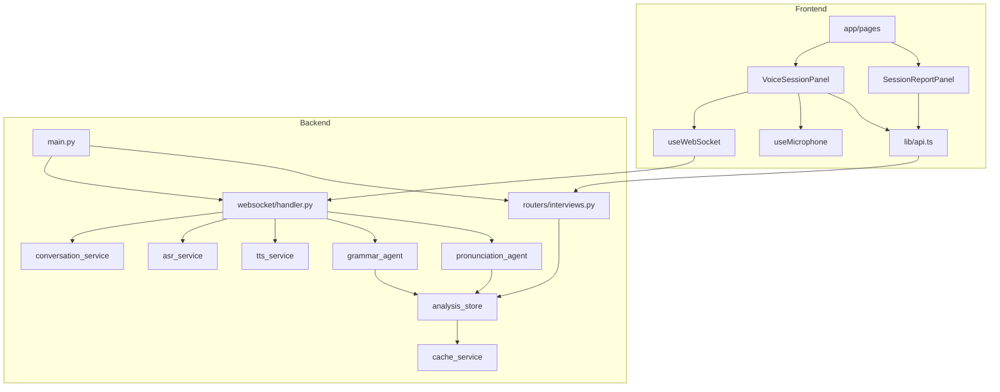

# OfferGPT 前后端代码结构速查

> **用途**：快速定位 Bug、理解模块职责、追踪数据流。  
> **分支**：`feat/realtime-light-correction`（含 Step 4 实时轻纠正 + 课后分析页）  
> **更新**：2026-06-06

---

## 1. 目录总览

```
AI英语面试官-英语口语陪练/
├── backend/                    # FastAPI 后端（工作目录必须是 backend/）
│   ├── main.py                 # 应用入口、CORS、WebSocket 路由注册
│   ├── config.py               # 环境变量 → Settings 单例
│   ├── database.py             # SQLAlchemy 异步引擎
│   ├── exceptions.py           # ApiError + 全局异常处理器
│   ├── routers/                # REST API
│   │   ├── scenes.py           # GET /api/scenes
│   │   ├── interviews.py       # 会话 CRUD + analysis + report
│   │   ├── resumes.py          # POST /api/resumes
│   │   └── jobs.py             # POST /api/jobs
│   ├── websocket/
│   │   └── handler.py          # ★ 实时语音管线核心编排
│   ├── services/
│   │   ├── conversation_service.py  # LLM 流式对话 + System Prompt
│   │   ├── asr_service.py           # Whisper ASR + EnergyVAD
│   │   ├── tts_service.py           # EdgeTTS 合成
│   │   ├── cache_service.py         # Redis / 内存兜底
│   │   ├── scene_service.py         # 场景静态配置
│   │   ├── resume_service.py        # 简历解析
│   │   ├── job_service.py           # JD 解析
│   │   └── realtime/                # ★ Step 4 异步分析
│   │       ├── grammar_agent.py     # 语法分析 + 轻纠正
│   │       ├── pronunciation_agent.py # 语速/停顿/低置信度词
│   │       ├── analysis_store.py    # cache 读写 analysis:{sid}
│   │       └── asr_filter.py        # ASR 误唤醒过滤
│   └── models/base.py            # User/Interview/Resume/Job 等 ORM
│
├── frontend/                   # Next.js 16 App Router
│   └── src/
│       ├── app/                # 页面路由（URL → 文件）
│       │   ├── page.tsx                    # 首页 /
│       │   ├── scenes/[scene]/page.tsx     # 场景配置 /scenes/interview
│       │   ├── interview/setup/page.tsx    # 面试资料 /interview/setup
│       │   ├── sessions/[sessionId]/page.tsx  # ★ 实时对话 /sessions/{id}
│       │   └── reports/[sessionId]/page.tsx   # ★ 课后报告 /reports/{id}
│       ├── components/
│       │   ├── VoiceSessionPanel.tsx   # ★ 会话 UI + WS 消息处理
│       │   ├── CorrectionToast.tsx     # 轻纠正 Toast
│       │   ├── SessionReportPanel.tsx  # 课后报告展示
│       │   ├── SceneConfigForm.tsx     # 场景/难度/轻纠正开关
│       │   ├── ResumeUploader.tsx
│       │   └── JobDescriptionEditor.tsx
│       ├── hooks/
│       │   ├── useWebSocket.ts         # WS 连接/重连/心跳
│       │   └── useMicrophone.ts        # 麦克风 PCM 采集
│       ├── lib/api.ts                  # REST 客户端
│       └── types/api.ts                # 前后端类型契约
│
├── tests/backend/              # pytest 单元/集成测试
└── docs/                       # 设计文档、API 契约、本速查
```

---

## 2. 用户主流程 → 代码映射

| 步骤 | 用户操作 | 前端入口 | 后端入口 |
|------|----------|----------|----------|
| 1 | 打开首页选场景 | `app/page.tsx` → `HomeContent` | `GET /api/scenes` → `routers/scenes.py` |
| 2 | 配置难度/轻纠正 | `SceneConfigForm.tsx` | — |
| 3 | 上传简历 + JD（面试） | `interview/setup/page.tsx` | `POST /api/resumes`, `POST /api/jobs` |
| 4 | 创建会话 | `lib/api.ts` → `createSession()` | `POST /api/interviews` → `interviews.py` |
| 5 | 进入实时对话 | `sessions/[id]/page.tsx` → `VoiceSessionPanel` | `WS /ws/interviews/{id}` → `handler.py` |
| 6 | 说话/打字 | `useMicrophone` / 文本框 | `audio.input` / `text.input` |
| 7 | 收到 AI 回复 + TTS | `VoiceSessionPanel` 消息 switch | `_run_conversation_pipeline` |
| 8 | 轻纠正 Toast | `CorrectionToast.tsx` | `grammar_agent` → `correction.light` |
| 9 | 结束会话 | 「结束对话」按钮 | `control.finish` + `POST .../finish` |
| 10 | 查看课后报告 | `reports/[id]/page.tsx` | `GET .../analysis`, `GET .../report` |

---

## 3. 实时语音数据流（核心）

```
[浏览器麦克风] useMicrophone.ts
    │ base64 PCM
    ▼
[WebSocket 上行] audio.input
    ▼
handler.py :: _handle_audio_input
    │ EnergyVAD 检测停顿
    ▼
handler.py :: _process_audio_turn
    │ asr_service.transcribe (Whisper)
    │ asr_filter.check (防误唤醒)
    ▼
[WebSocket 下行] asr.partial → asr.final
    │
    ├─► _run_conversation_pipeline (主链路，同步 await)
    │       conversation_service.stream_chat (DeepSeek)
    │       → agent.text.delta / agent.text.done
    │       tts_service.synthesize_stream
    │       → tts.audio.delta
    │
    └─► _run_async_analysis (asyncio.create_task，不阻塞)
            grammar_agent.analyze → correction.light / analysis.counter
            pronunciation_agent.analyze → analysis_store (cache)
```

**关键文件**：`backend/websocket/handler.py`（一切实时逻辑的编排中心）

---

## 4. Step 4 轻纠正 & 课后分析

### 4.1 实时轻纠正

| 环节 | 文件 | 说明 |
|------|------|------|
| 规则检测 | `grammar_agent.py` | `have did`→`have done` 等，无 API Key 也可演示 |
| LLM 增强 | `grammar_agent.py` | 有 `DEEPSEEK_API_KEY` 时补充判定 |
| 策略开关 | `scene_config.realtimeLightCorrection` | 创建会话时传入 |
| 运行时开关 | `control.correction` WS 消息 | `VoiceSessionPanel` 底部 checkbox |
| 前端 Toast | `CorrectionToast.tsx` | 收到 `correction.light` 弹出 |
| 语气词计数 | `analysis.counter` WS 消息 | 顶部 `um:2` 显示 |

### 4.2 课后分析存储

```
cache key: analysis:{sessionId}
{
  "corrections": [{ turnId, original, corrected, severity, transcript }],
  "fillerCounts": { "um": 2, "uh": 1 },
  "pronunciation": [{ turnId, wordsPerMinute, pauseCount, lowConfidenceWords, ... }]
}
```

| 操作 | 文件 |
|------|------|
| 写入 | `analysis_store.py` |
| 读取 API | `GET /api/interviews/{id}/analysis` → `interviews.py` |
| 前端展示 | `SessionReportPanel.tsx` |

---

## 5. WebSocket 消息速查

### 上行（客户端 → 服务端）

| type | 发送位置 | 处理函数 |
|------|----------|----------|
| `audio.input` | `useMicrophone` → `VoiceSessionPanel` | `_handle_audio_input` |
| `text.input` | `VoiceSessionPanel` 发送按钮 | `_handle_text_input` |
| `control.finish` | 结束对话按钮 | `_handle_finish` |
| `control.correction` | 轻纠正开关 | `_handle_correction_toggle` |
| `ping` | `useWebSocket` 心跳 | 返回 `pong` |

### 下行（服务端 → 客户端）

| type | 处理位置（前端） | 含义 |
|------|------------------|------|
| `asr.partial` | `VoiceSessionPanel` | 实时字幕 |
| `asr.final` | `VoiceSessionPanel` | 用户发言定稿 |
| `asr.no_result` | `VoiceSessionPanel` | 未识别到有效语音 |
| `agent.text.delta` | `VoiceSessionPanel` | AI 流式文本 |
| `agent.text.done` | `VoiceSessionPanel` | AI 文本完成 |
| `tts.audio.delta` | `VoiceSessionPanel` → `playAudio` | TTS 音频 |
| `correction.light` | `VoiceSessionPanel` → `CorrectionToast` | 轻纠正提示 |
| `analysis.counter` | `VoiceSessionPanel` | 语气词计数 |
| `control.finish` | `VoiceSessionPanel` → 跳转报告页 | 会话结束 |
| `error` | `VoiceSessionPanel` console | 服务端错误 |

完整协议：`docs/agent-team/api-contract.md`

---

## 6. REST API 速查

| 方法 | 路径 | 文件 | 用途 |
|------|------|------|------|
| GET | `/api/scenes` | `scenes.py` | 场景列表 |
| POST | `/api/resumes` | `resumes.py` | 上传简历 |
| POST | `/api/jobs` | `jobs.py` | 创建 JD |
| POST | `/api/interviews` | `interviews.py` | 创建会话 → 返回 `websocketUrl` |
| GET | `/api/interviews/{id}` | `interviews.py` | 会话详情 |
| POST | `/api/interviews/{id}/finish` | `interviews.py` | 标记 completed |
| GET | `/api/interviews/{id}/analysis` | `interviews.py` | ★ 课后分析数据 |
| GET | `/api/interviews/{id}/report` | `interviews.py` | Offer Score 报告（占位） |
| GET | `/health` | `main.py` | 健康检查 |

前端封装：`frontend/src/lib/api.ts`

---

## 7. Bug 定位速查表

| 现象 | 优先检查 | 常见原因 |
|------|----------|----------|
| 后端启动报 `app not found` | 启动目录 | 必须在 `backend/` 下执行 uvicorn |
| 说话无 AI 回应 | `conversation_service.py`、`.env` | `DEEPSEEK_API_KEY` 未配置 |
| 语音识别不可用 | `asr_service.py`、`config.py` | `ENABLE_MOCK_ASR=true` 或 Whisper 未安装 |
| TTS 无声音 | `tts_service.py` | `ENABLE_MOCK_TTS=true`；EdgeTTS 网络问题 |
| 未检测到有效语音 | `asr_filter.py` | 置信度/词数过滤过严；说话太短 |
| WebSocket 连不上 | `interviews.py` `_build_websocket_url` | `WS_BASE_URL` 错误；CORS |
| 轻纠正不弹出 | `grammar_agent.py`、`handler.py` | 开关关闭；句子无严重错误 |
| 报告页 404 | `app/reports/[sessionId]/page.tsx` | 路由未部署；URL 写错 |
| 报告页无数据 | `analysis_store.py`、Redis | cache 为空；Redis 连接失败用内存且已重启 |
| `/reports/xxx` 以前 404 | 现已实现 | 需使用新分支代码 |
| Redis 认证失败 | `.env.local` | `REDIS_PASSWORD` 行格式错误（与其他变量粘连） |
| 前端 API 请求失败 | `lib/api.ts` | `NEXT_PUBLIC_API_BASE_URL` 未配置 |
| 结束会话不跳转报告 | `VoiceSessionPanel` `navigateToReport` | `finishSession` 失败；检查网络 |
| 麦克风无法开启 | `useMicrophone.ts` | 浏览器权限；HTTPS/localhost 限制 |
| 双开 Next.js 冲突 | 终端 | 3000 端口已有进程，需 taskkill |

---

## 8. 配置与环境变量

| 变量 | 作用 | 本地推荐值 |
|------|------|-----------|
| `DEEPSEEK_API_KEY` | AI 对话 + Grammar LLM 增强 | 必填（DeepSeek 控制台申请） |
| `ENABLE_MOCK_ASR` | 关闭才用真实 Whisper | `false` |
| `ENABLE_MOCK_TTS` | 关闭才合成语音 | `false` |
| `WS_BASE_URL` | WebSocket 地址 | `ws://localhost:8000` |
| `NEXT_PUBLIC_API_BASE_URL` | 前端 REST 地址 | `http://localhost:8000` |
| `NEXT_PUBLIC_WS_BASE_URL` | 前端 WS（如单独配置） | `ws://localhost:8000` |
| `REDIS_URL` | 分析数据持久化 | 服务器 Redis 或本地 |
| `DATABASE_URL` | 会话/简历存储 | SQLite 或 PostgreSQL |

配置文件优先级：`backend/.env` ← 被覆盖 ← 根目录 `.env.local`

详见：`docs/environment-variables.md`、`docs/configuration.md`

---

## 9. 测试与验证

```bash
# 后端单元测试（项目根目录）
python -m pytest tests/backend/test_grammar_agent.py -v
python -m pytest tests/backend/test_pronunciation_agent.py -v
python -m pytest tests/backend/test_websocket_handler.py -v

# 启动后端（必须在 backend 目录）
cd backend && python -m uvicorn main:app --reload --port 8000

# 启动前端
cd frontend && npm run dev
```

| 验收场景 | 操作 | 预期 |
|----------|------|------|
| 轻纠正 | 输入 `I have did a project` | Toast 提示 + AI 正常回复 |
| 语气词 | 说 `Um, I think...` | 顶部出现 `um:1` |
| 关闭纠正 | 取消勾选轻纠正开关 | 不再弹 Toast |
| 课后报告 | 结束会话 | 跳转 `/reports/{id}`，展示 WPM/纠正/语气词 |

---

## 10. 模块依赖关系图



---

## 11. 相关文档索引

| 文档 | 内容 |
|------|------|
| [代码说明文档.md](./代码说明文档.md) | 模块详细说明（偏设计） |
| [api-contract.md](./agent-team/api-contract.md) | WS/REST 字段契约 |
| [configuration.md](./configuration.md) | 全量配置项 |
| [environment-variables.md](./environment-variables.md) | 环境变量生成脚本 |
| [运行操作手册.md](./运行操作手册.md) | 启动与排错步骤 |
| [README.md](../README.md) | 快速启动 + Step 4 验证 |

---

## 12. 改 Bug 时的建议顺序

1. **复现路径**：确认是 REST 还是 WebSocket 问题（浏览器 Network → WS 帧 / Fetch）
2. **看后端日志**：`[WS]`、`[ASR]`、`[GrammarAgent]`、`[Cache]` 前缀
3. **查本表第 7 节**：按现象定位文件
4. **查数据流第 3/4 节**：确认断在哪一环
5. **跑对应用例**：`tests/backend/test_*.py`
6. **改完后手动走一遍主流程**（第 2 节表格）
